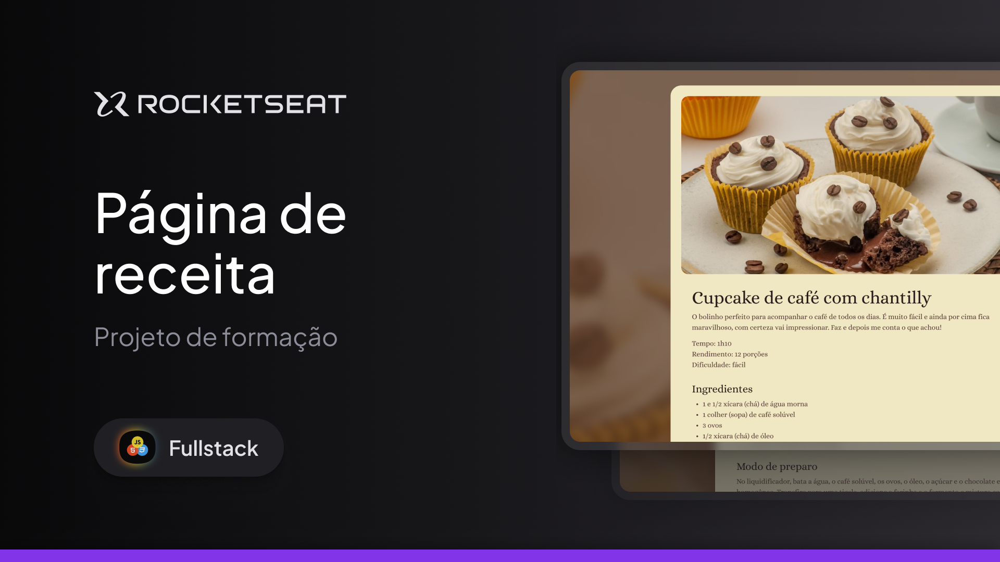

# Boas-vindas ao projeto:

### Página de receita 🎂

Nesse projeto você vai desenvolver uma página simples de receita.

Esse é um dos projetos desenvolvidos em aula na formação Full-stack, um de nossos conteúdos de especialização.

<h1 align="center"> DevLinks </h1>

Curso exclusivo e gratuito, promovido pela Rocketseat para ensino de tecnologias WEB.

  <a href="#-tecnologias">Tecnologias</a>&nbsp;&nbsp;&nbsp;|&nbsp;&nbsp;&nbsp;
  <a href="#-projeto">Projeto</a>

  

 

## 🚀 Tecnologias

Esse projeto foi desenvolvido com as seguintes tecnologias:

- HTML e CSS
- Git e Github
- Figma

## 💻 Projeto

O

O

---

Feito com ♥ by Rocketseat

[Participe da nossa comunidade!](https://discord.gg/rocketseat)
